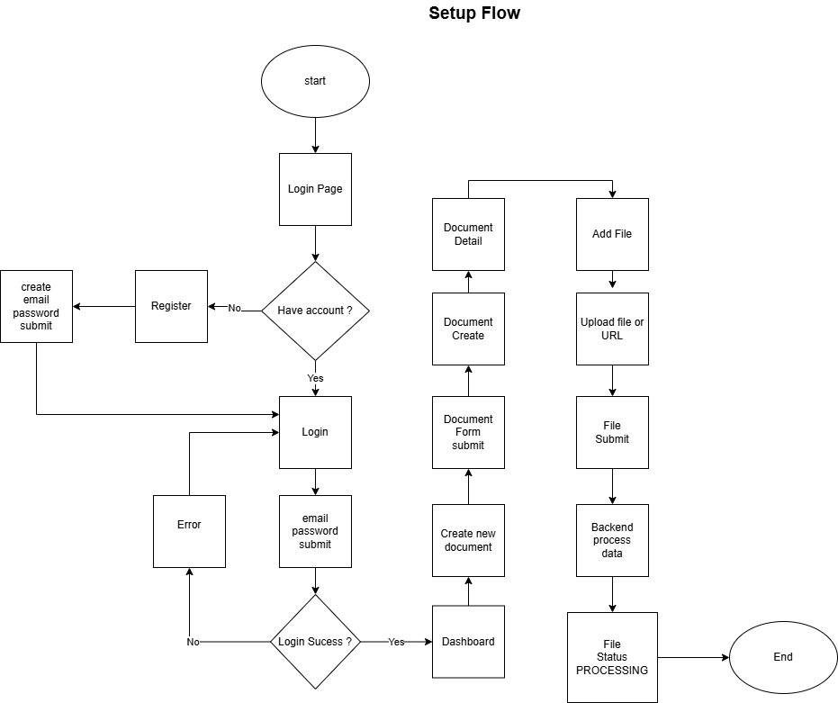
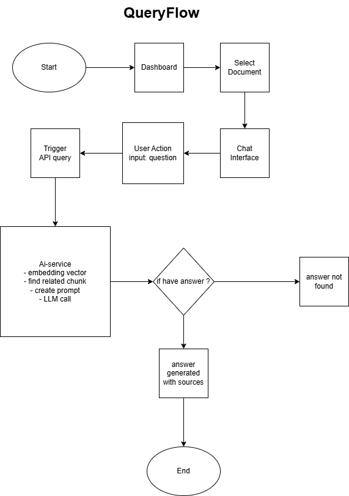

# 🚀 Advanced AI-Powered Knowledge Hub
This project is a personal knowledge management system that uses AI to understand, summarize, and answer questions from various document formats (PDF, images, text) uploaded by the user.
## 🛠️ Tech Stack

- **Frontend:** Next.js, React, Tailwind CSS
- **Backend (Gateway):** Node.js, Express.js, BullMQ
- **AI Engine:** Python, FastAPI, Celery
- **Databases:** PostgreSQL (for User/Doc data), ChromaDB (for Vectors)
- **Infrastructure:** Docker, Redis, MinIO (S3-compatible)

## ✅ To-Do List & Roadmap

### Phase 1: Setup & Foundations (Week 1)
- [x] Plan architecture and select Tech Stack
- [x] Set up Monorepo Git repository structure
- [x] Set up Relational Database Schematic
- [x] Configure `docker-compose.yml` for local development
- [x] Create basic User Authentication API (Register/Login) in `main-backend`
- [ ] Create basic UI for Login/Register/Dashboard in `frontend`

### Phase 2: MVP Core Logic (Week 2)
- [x] **(Backend)** Create API for file uploads and enqueueing jobs
- [x] **(AI Service)** Create Worker to consume jobs, perform OCR, and create embeddings
- [x] **(AI Service)** Store vector embeddings in ChromaDB
- [ ] **(Frontend)** Create UI for file uploads and status display
- [x] **(Integration)** Implement end-to-end document upload flow

### Phase 3: RAG & Chat Interface (Week 3)
- [x] **(AI Service)** Create API endpoint to handle questions and perform RAG
- [ ] **(Frontend)** Create Chat Interface for Q&A
- [x] **(Backend)** Create gateway API for the chat flow
- [ ] **(Integration)** Implement end-to-end Q&A flow

### Phase 4: CI/CD & Polish (Week 4)
- [ ] Create Dockerfile for each service
- [ ] Set up CI/CD pipeline with GitHub Actions for demo deployment
- [ ] Write basic unit tests for critical parts
- [ ] Polish UI/UX and finalize README documentation
- [ ] **(Stretch Goal)** Add advanced RAG features (Hybrid Search, Re-ranking)

### User Flow Diagram
- setup flow 
- query flow 